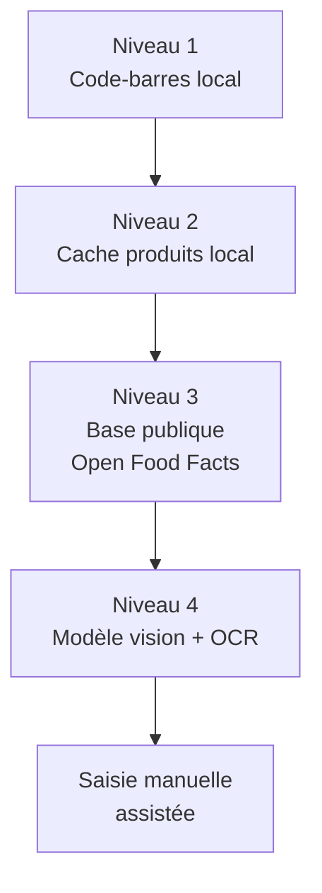
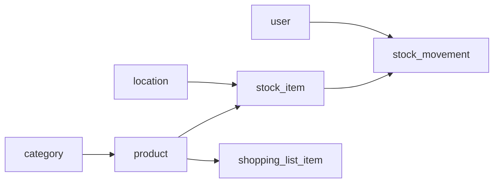
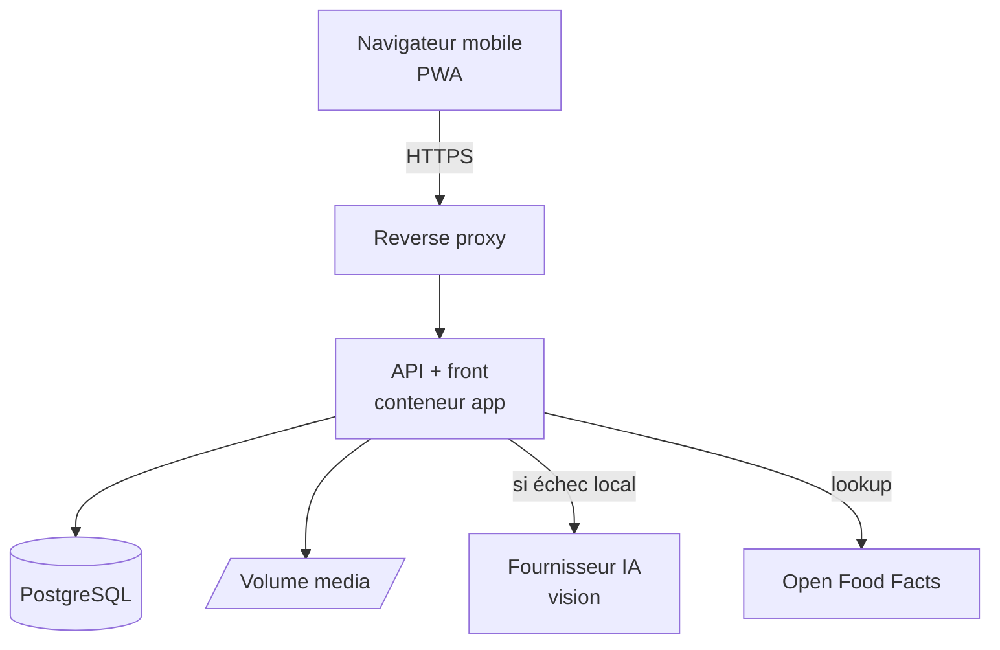
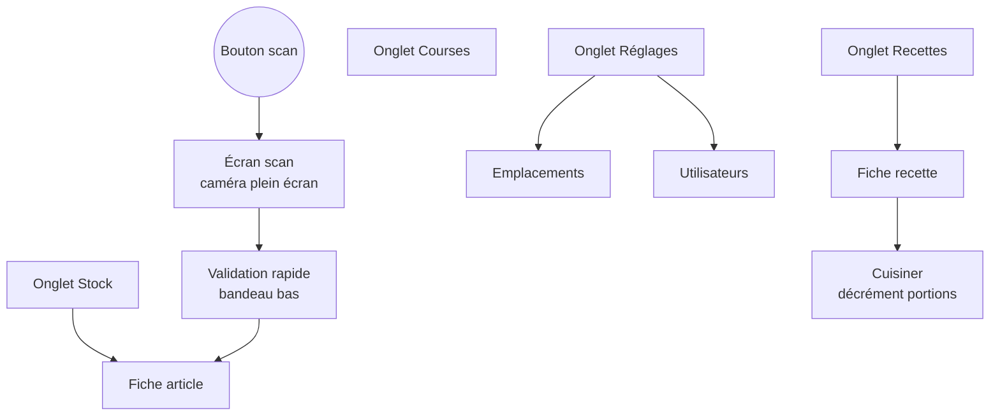

# Cahier des charges — Inventaire alimentaire maison (scan IA, self-hosted)

2026-09-18 · @Franck

Application web auto-hébergée qui inventorie tous les produits comestibles de la maison par scan photo depuis le téléphone, suit les dates de péremption, et propose des recettes réalisables avec ce qui est effectivement en stock, filtrables par difficulté et par type de cuisine.

**Lecture par un agent de développement.** Tout ce document est normatif sauf la section 23, qui est une évaluation à mener, et la décision 1 de la section 25, qui reste ouverte. Les exigences EF-01 à EF-28 sont les références stables à citer dans les commits, les tests et les revues. En cas de contradiction entre deux sections, les décisions de la section 25 tranchent. Ce qui n'est pas spécifié ici est laissé au jugement : le signaler dans la réponse plutôt que l'inventer silencieusement.

## 1. Contexte et objectifs

L'objectif est de connaître à tout moment le contenu comestible de la maison sans ouvrir un placard, en scannant les produits avec l'appareil photo du téléphone.

Le besoin part d'un constat domestique : les stocks sont répartis entre plusieurs placards, un congélateur et un réfrigérateur, avec une part importante de produits asiatiques (nouilles, sauces, conserves, épices) souvent mal référencés par les bases de données grand public, parfois avec un étiquetage non latin.

**Objectifs**

1. Référencer l'ensemble des produits alimentaires de la maison, avec quantité et emplacement.
2. Rendre la saisie assez rapide pour être tenue dans la durée : moins de 5 secondes par article en moyenne.
3. Alerter avant péremption plutôt que de découvrir les dates après coup.
4. Proposer des recettes réalisables avec le stock du moment, filtrables par difficulté et par type de cuisine, pour répondre à « on mange quoi ce soir ? » (section 12).
5. Tout héberger à la maison, sans dépendance à un service tiers pour les données.

**Critères de succès**

| Critère | Cible |
| --- | --- |
| Taux de reconnaissance automatique au scan | ≥ 80 % des articles sans saisie manuelle |
| Temps de saisie d'un article connu | ≤ 5 s |
| Temps d'inventaire initial complet | ≤ 4 h réparties sur plusieurs sessions |
| Écart inventaire théorique / réel après 1 mois | ≤ 15 % des articles |
| Disponibilité du service | Utilisable hors connexion Internet, en LAN |
| Recettes proposées pour un stock courant | ≥ 3 recettes réalisables sans ingrédient manquant |

## 2. Périmètre

Le périmètre se lit en deux fonctions complémentaires : inventorier (lot 1), puis cuisiner à partir de cet inventaire (lot 2). La domotique et les statistiques viennent après.

**Lot 1 — inventaire (MVP)**

- Scan code-barres par la caméra du téléphone.
- Reconnaissance photo par IA pour les produits sans code-barres lisible ou absents des bases.
- Fiche produit : nom, marque, catégorie, photo, quantité, unité, emplacement, DLC/DDM.
- Emplacements imbriqués à profondeur libre (pièce, meuble, étagère, bac, autant de niveaux que voulu).
- Sortie de stock rapide (« je consomme »), y compris par scan.
- Recherche et filtres : texte, catégorie, emplacement, péremption.
- Multi-utilisateur (les membres du foyer partagent le même inventaire).

**Lot 2 — module recettes et usage quotidien**

- Suggestions de recettes réalisables avec le stock disponible, classées par taux de couverture des ingrédients.
- Filtres sur les suggestions : difficulté, type de cuisine (origine), temps, type de plat, régime alimentaire.
- Priorité donnée aux recettes qui consomment les articles proches de leur date de péremption.
- Ajout en un geste des ingrédients manquants à la liste de courses.
- Décrément du stock après cuisson, ajusté au nombre de portions réalisées.
- Seuils de réapprovisionnement, alertes de péremption, mode hors ligne, export.

Le module recettes est détaillé en section 12.

**Lots suivants**

- Génération de recettes par IA à partir du stock, import de recettes depuis une URL, notation.
- Statistiques de consommation et prévision de réachat.
- Import de tickets de caisse par OCR.
- Intégration Home Assistant.

**Explicitement hors périmètre**

- Produits non comestibles : entretien, hygiène et pharmacie sont exclus, sans réserve. Le modèle ne prévoit pas de champ pour les accueillir.
- Gestion budgétaire et suivi des prix.
- Application native iOS/Android publiée sur les stores.
- Tout accès public non authentifié.

## 3. Parcours utilisateurs

Quatre parcours structurent l'application ; le parcours « rangement des courses » est celui qui doit être le plus rapide.

**P1 — Inventaire initial.** L'utilisateur se place devant un placard, sélectionne l'emplacement courant une fois, puis enchaîne les scans en rafale. La caméra reste ouverte entre deux articles. Chaque article reconnu est ajouté avec quantité 1 et l'emplacement présélectionné ; un bandeau permet de corriger dans les 5 secondes.

**P2 — Rangement des courses.** Même mode rafale, mais avec saisie ou capture de la DLC quand le produit est périssable. L'application propose la date lue sur l'emballage par OCR, l'utilisateur valide ou corrige.

**P3 — Consommation.** Depuis la recherche ou par scan, l'utilisateur décrémente la quantité. Un appui long sur un article propose « tout consommer ». Un article à zéro bascule en liste de courses si un seuil est défini.

**P4 — Consultation.** Depuis le téléphone en magasin ou devant les fourneaux : recherche par nom, filtre par emplacement, vue « périme bientôt », vue « à racheter ».


Le chemin nominal tient en deux gestes : viser, valider. Toute étape supplémentaire doit être optionnelle.

## 4. Exigences fonctionnelles

| Réf | Exigence | Priorité |
| --- | --- | --- |
| EF-01 | Scanner un code-barres EAN-8/EAN-13/UPC via la caméra, en continu, sans recharger la page | Must |
| EF-02 | Interroger une base produits et pré-remplir nom, marque, catégorie, image | Must |
| EF-03 | Photographier un produit non identifié et obtenir une proposition de fiche par IA vision | Must |
| EF-04 | Lire une étiquette non latine (japonais, coréen, chinois, thaï) et proposer nom translittéré + nom français | Must |
| EF-05 | Créer un produit manuellement, sans code-barres (vrac, bocaux, restes, préparations maison) | Must |
| EF-06 | Gérer des emplacements imbriqués à profondeur libre, avec un emplacement « courant » collant pendant une session de scan | Must |
| EF-07 | Gérer quantité et unité (pièce, g, kg, ml, l, paquet) avec conversion simple | Must |
| EF-08 | Saisir une DLC/DDM, avec proposition par OCR depuis la photo de l'emballage | Must |
| EF-09 | Lister les articles périmant sous X jours, X paramétrable | Must |
| EF-10 | Décrémenter le stock par scan ou depuis la fiche, avec historique des mouvements | Must |
| EF-11 | Rechercher en texte libre, tolérant aux fautes et aux synonymes (« nouilles » trouve « ramen ») | Must |
| EF-12 | Définir un seuil minimum par produit et alimenter une liste de courses | Should |
| EF-13 | Gérer plusieurs comptes utilisateurs sur un inventaire partagé | Should |
| EF-14 | Corriger une reconnaissance erronée et mémoriser la correction pour le même code-barres | Should |
| EF-15 | Fonctionner en mode dégradé sans connexion Internet : scan et saisie mis en file, synchronisés au retour | Should |
| EF-16 | Exporter l'inventaire complet en CSV et JSON | Should |
| EF-17 | Proposer des recettes réalisables avec le stock disponible | Should |
| EF-18 | Décrémenter le stock après validation d'une recette cuisinée | Should |
| EF-19 | Notifier les péremptions par push, e-mail ou webhook | Could |
| EF-20 | Importer un ticket de caisse photographié et en extraire les lignes | Could |

La colonne priorité suit MoSCoW : les *Must* conditionnent la recette du lot 1. Les exigences propres aux recettes sont numérotées EF-21 à EF-28 en section 12.

## 5. Moteur de reconnaissance

La reconnaissance suit une cascade à quatre niveaux, du moins cher au plus coûteux ; on ne passe au niveau suivant que si le précédent échoue.



**Niveau 1 — décodage du code-barres.** Entièrement côté navigateur, sans réseau. Bibliothèques candidates : l'API native `BarcodeDetector` quand elle est disponible, sinon ZXing compilé en WebAssembly. Formats requis : EAN-13, EAN-8, UPC-A, UPC-E, QR.

**Niveau 2 — cache local.** Chaque produit déjà rencontré est stocké côté serveur. Un code-barres déjà vu est résolu instantanément et hors ligne. C'est ce niveau qui fait tenir la cible des 5 secondes après quelques semaines d'usage.

**Niveau 3 — base publique.** [Open Food Facts](https://world.openfoodfacts.org) sert de source principale : base collaborative sous licence ouverte, API publique documentée sans clé ([documentation API](https://openfoodfacts.github.io/openfoodfacts-server/api/)), avec nom, marque, catégories, quantité et image. La couverture des produits d'épicerie asiatique importés y est inégale — c'est précisément le cas d'usage qui justifie le niveau 4.

**Niveau 4 — vision et OCR.** Une photo de l'article est envoyée à un modèle multimodal qui renvoie un JSON strict : nom probable en français, nom original translittéré, marque, catégorie, type de conditionnement, indice de confiance. Le même appel extrait la date de péremption si elle est visible. Deux options d'implémentation, à trancher :

| Option | Avantages | Inconvénients |
| --- | --- | --- |
| API cloud (Claude, GPT, Gemini) | Bien meilleure lecture des étiquettes japonaises/coréennes, aucun GPU requis, mise en œuvre rapide | Coût à l'appel, dépendance réseau, photos des placards envoyées à un tiers |
| Modèle local (Ollama + modèle vision, ou PaddleOCR + classifieur) | Zéro coût marginal, données qui ne sortent pas du réseau, fonctionne hors ligne | Demande un GPU ou beaucoup de RAM, qualité nettement plus faible sur idéogrammes, tuning à prévoir |

Recommandation : commencer par l'API cloud avec une clé configurable, en gardant l'appel derrière une interface `RecognitionProvider` pour pouvoir basculer vers un modèle local sans toucher au reste du code. Les photos sont compressées à 1024 px de large avant envoi, ce qui limite coût et latence.

**Apprentissage par correction.** Toute correction manuelle sur un code-barres alimente le cache local. Au deuxième scan du même produit, aucune IA n'est appelée.

## 6. Modèle de données

La distinction centrale est entre **produit** (le référentiel, un par code-barres) et **lot de stock** (un exemplaire physique, avec sa date et son emplacement). Sans cette séparation, impossible de gérer deux boîtes du même produit avec deux DLC différentes.



| Entité | Champs principaux |
| --- | --- |
| `product` | id, barcode (unique, nullable), nom, nom\_original, marque, category\_id, unité\_par\_défaut, image\_path, seuil\_min, source\_reconnaissance, confiance, créé\_le |
| `stock_item` | id, product\_id, location\_id, quantité, unité, date\_péremption, type\_date (DLC/DDM), ouvert (bool), date\_ouverture, prix\_achat (nullable), créé\_le |
| `location` | id, nom, parent\_id, type (libre : pièce, meuble, étagère, bac…), profondeur, température (ambiant/frais/congelé), ordre |
| `stock_movement` | id, stock\_item\_id, type (entrée/sortie/ajustement/perte), delta, motif, user\_id, horodatage |
| `category` | id, nom, parent\_id, icône, durée\_conservation\_indicative |
| `user` | id, nom, e-mail, hash\_mdp, rôle (admin/membre), créé\_le |
| `shopping_list_item` | id, product\_id (nullable), libellé\_libre, quantité, coché, ajouté\_par, source (manuel/seuil) |
| `recognition_log` | id, image\_path, résultat\_brut, provider, coût, corrigé\_en, horodatage |

**Règles de gestion**

- Un `stock_item` à quantité 0 est archivé, pas supprimé : l'historique de consommation sert aux statistiques et aux prévisions de réachat.
- Les périssables non emballés (fruits, légumes, produits du marché) entrent dans l'inventaire sans code-barres ni date imprimée : la DLC est estimée à la saisie en ajoutant la `durée_conservation_indicative` de leur catégorie, et le champ est marqué comme estimé pour que l'interface le distingue d'une date lue sur un emballage.
- `recognition_log` conserve les échecs de reconnaissance : ce sont les cas à rejouer quand le modèle change.
- Les images sont stockées sur le disque, pas en base ; la base ne garde que le chemin.
- La suppression d'un `location` est interdite si des `stock_item` y sont rattachés, ou s'il a des emplacements enfants.

Les entités du module recettes (`recipe`, `recipe_ingredient`, `cuisine`, `recipe_log`) sont décrites en section 12 : elles se greffent sur `product`, jamais sur `stock_item`, puisqu'une recette parle de produits et non d'exemplaires.

## 7. Architecture technique

Une application web unique servie par un back-end API, avec une base relationnelle et un dossier de médias : trois conteneurs au maximum, pour rester maintenable en auto-hébergement.



| Couche | Choix proposé | Justification |
| --- | --- | --- |
| Front | React + Vite, TypeScript, Tailwind | PWA installable, écosystème mature pour l'accès caméra |
| Scan | `BarcodeDetector` natif avec repli ZXing-WASM | Décodage local, pas d'aller-retour serveur |
| API | NestJS (TypeScript), Prisma pour l'accès aux données | Un seul langage sur tout le projet, front et back ; types partagés entre les deux |
| Base | PostgreSQL 16 | Recherche plein texte native, extension `pg_trgm` pour la tolérance aux fautes (EF-11) |
| Fichiers | Volume Docker monté | Plus simple qu'un MinIO pour un usage familial |
| Tâches planifiées | Cron applicatif intégré | Alertes péremption quotidiennes, pas besoin de Celery |
| Auth | Comptes locaux, session par cookie httpOnly | Pas de dépendance à un fournisseur d'identité ; OIDC possible plus tard sans refonte du modèle utilisateur |

Le back-end est en TypeScript : la reconnaissance passant par une API externe, aucun traitement d'image lourd ne tourne côté serveur, ce qui retire le seul argument en faveur de Python. Si un modèle local est ajouté plus tard, il sera déployé comme un service séparé derrière l'interface `RecognitionProvider`, sans changer le langage du back-end.

**Contrat d'API** — REST, préfixé `/api/v1`, documenté en OpenAPI :

- `POST /scan/barcode` — code-barres en entrée, fiche produit résolue ou 404 en sortie
- `POST /scan/image` — image en entrée, proposition de fiche avec indice de confiance
- `GET|POST|PATCH|DELETE /products`, `/stock`, `/locations`, `/shopping-list`
- `POST /stock/{id}/consume` — décrément avec motif
- `GET /stock/expiring?days=7`
- `POST /sync` — file d'attente des opérations effectuées hors ligne

## 8. Application mobile

Une PWA installable plutôt qu'une application native : un seul code, installation sans store, mise à jour immédiate. C'est suffisant dès lors que l'accès caméra passe par `getUserMedia`.

**Contrainte bloquante à connaître avant de coder** : l'accès caméra n'est autorisé que dans un contexte sécurisé, c'est-à-dire en HTTPS ou sur `localhost`. Une exposition en `http://192.168.x.x` ne permettra pas de scanner. Le certificat TLS n'est donc pas une option de confort, c'est un prérequis fonctionnel (voir section 9).

**Exigences d'interface**

- Cible : écran de téléphone tenu à une main, actions principales dans le tiers inférieur.
- Le bouton scan est accessible depuis n'importe quel écran.
- Mode rafale : la caméra ne se ferme pas entre deux articles, retour haptique et sonore à chaque code reconnu.
- L'emplacement courant reste sélectionné tant que l'utilisateur ne le change pas, affiché en permanence pendant le scan.
- Annulation du dernier ajout accessible pendant 5 secondes, sans ouvrir de fiche.
- Thème sombre par défaut, contraste suffisant pour un usage dans un cellier peu éclairé.

**Hors ligne**

- Service worker : coque applicative et référentiel produits mis en cache.
- Les scans réalisés sans réseau sont mis en file dans IndexedDB, puis rejoués via `POST /sync`.
- Résolution de conflit : dernière écriture gagnante sur les quantités, avec journal des mouvements conservé pour audit.
- Les appels au niveau 4 (vision) sont impossibles hors ligne ; l'article est alors enregistré comme « à identifier » avec sa photo, et traité au retour du réseau.

## 9. Déploiement et exploitation

Livraison sous forme d'une stack `docker compose` de trois services, déployable telle quelle depuis Dockge, avec le TLS assuré par le reverse proxy existant.

| Service | Image | Rôle | Volume |
| --- | --- | --- | --- |
| `app` | image applicative buildée | API + front statique | `./media:/app/media` |
| `db` | `postgres:16-alpine` | Base de données | `./pgdata:/var/lib/postgresql/data` |
| `backup` | conteneur cron léger | Dump quotidien + rotation | `./backups` |

**Exigences de packaging**

- Un seul `docker-compose.yml` et un `.env.example` documenté, sans valeur secrète en dur.
- Image multi-architecture `linux/amd64` et `linux/arm64` : le déploiement doit rester possible sur un mini-PC comme sur un Raspberry Pi.
- Migrations de schéma jouées automatiquement au démarrage, idempotentes.
- Healthcheck sur `/api/v1/health`, redémarrage automatique `unless-stopped`.
- Aucun port publié directement sur l'hôte hormis celui consommé par le reverse proxy.
- Empreinte cible au repos : moins de 1 Go de RAM pour la stack complète, hors modèle de vision local.

**Variables d'environnement attendues**

- `DATABASE_URL`, `SECRET_KEY`, `PUBLIC_URL`
- `VISION_PROVIDER` (`none` | `anthropic` | `openai` | `ollama`), `VISION_API_KEY`, `VISION_MODEL`
- `OFF_USER_AGENT` — Open Food Facts demande un en-tête identifiant l'application appelante
- `EXPIRY_ALERT_DAYS`, `TZ`

**Exploitation**

- Sauvegarde : dump PostgreSQL quotidien plus copie du dossier média, rétention 30 jours, testée par une restauration à blanc avant la mise en service.
- Journalisation sur la sortie standard, au format structuré, sans photo ni contenu d'image dans les logs.
- Mise à jour : `docker compose pull && up -d`, sans perte de données, avec migration réversible sur au moins une version.

## 10. Sécurité et données

L'application est destinée au foyer, mais elle doit être joignable depuis l'extérieur pour servir en magasin — ce qui impose un niveau de sécurité supérieur à celui d'un service purement LAN.

- Authentification obligatoire sur toutes les routes, y compris les endpoints de scan.
- Mots de passe hachés en Argon2id ; pas de compte par défaut, création du premier administrateur à l'installation.
- Sessions par cookie `httpOnly`, `Secure`, `SameSite=Lax`, expiration longue mais révocable, car le cas d'usage est un téléphone personnel.
- Limitation de débit sur `/scan/image` : c'est la seule route qui engage un coût externe.
- TLS terminé par le reverse proxy, avec certificat valide — prérequis de l'accès caméra (section 8).
- Exposition retenue : sous-domaine dédié publié par le reverse proxy. L'application étant joignable depuis Internet, quatre mesures sont obligatoires : limitation des tentatives de connexion, verrouillage temporaire après échecs répétés, en-tête noindex sur toutes les réponses, et aucune route accessible sans session valide, fichiers média compris.

**Données personnelles.** L'inventaire alimentaire d'un foyer révèle des habitudes de consommation et, indirectement, des informations de santé et de pratique religieuse. Conséquences concrètes :

- Aucune télémétrie, aucun envoi de données d'usage vers un tiers.
- Si un fournisseur IA cloud est retenu, seules les photos d'articles sont transmises, jamais la base d'inventaire ; le choix du fournisseur se fait en vérifiant sa politique de rétention.
- Les contributions vers Open Food Facts, si elles sont un jour implémentées, restent une action explicite de l'utilisateur, jamais automatique.

## 11. Intégrations

Aucune intégration n'est requise au lot 1, mais l'API doit être conçue pour les rendre possibles sans refonte.

| Intégration | Usage | Mécanisme |
| --- | --- | --- |
| Home Assistant | Capteurs « articles périmant sous 7 jours », « articles à racheter » ; annonce vocale ou affichage sur tablette murale | Endpoints REST en lecture + jeton de service dédié, ou publication MQTT avec découverte automatique |
| Notifications | Alerte péremption hebdomadaire | Webhook sortant générique, configurable (Home Assistant, Gotify, ntfy, e-mail) |
| Assistant conversationnel | Poser des questions en langage naturel sur le stock | Serveur MCP exposant des outils de lecture de l'inventaire |
| Export | Reprise de données, analyses ponctuelles | CSV et JSON via l'API, protégés par authentification |

La piste Home Assistant est la plus immédiatement utile : elle transforme les alertes de péremption en quelque chose que le foyer voit passer sans ouvrir l'application. Prévoir dès le lot 1 un jeton de service en lecture seule évite d'avoir à rétro-ajouter un mécanisme d'authentification machine-à-machine.

Le serveur MCP, lui, suppose que l'inventaire soit fiable : ce n'est intéressant qu'une fois l'usage quotidien installé.

## 12. Module recettes

L'application propose des recettes réalisables avec ce qui est réellement en stock, filtrables par difficulté et par type de cuisine. C'est la finalité du module : l'inventaire n'est pas un but en soi, il sert à répondre à « on mange quoi ce soir ».

**Principe de correspondance.** Pour chaque recette, l'application calcule un taux de couverture : part des ingrédients présents en stock, en tenant compte des quantités. Les résultats sont classés en trois groupes.

| Groupe | Règle | Affichage |
| --- | --- | --- |
| Réalisable | 100 % des ingrédients en stock, quantités suffisantes | En tête de liste |
| Presque | 1 ou 2 ingrédients manquants, dont aucun ingrédient principal | Avec la liste de ce qui manque, ajoutable aux courses en un geste |
| À écarter | Au-delà, ou ingrédient principal absent | Masqué par défaut |

Un bonus de classement est appliqué aux recettes qui consomment des articles proches de leur date de péremption : c'est le croisement qui a le plus de valeur au quotidien.

**Filtres exigés**

| Filtre | Valeurs | Comportement |
| --- | --- | --- |
| Difficulté | Très facile, Facile, Intermédiaire, Difficile | Échelle fixe à quatre niveaux ; calculée automatiquement d'après le nombre d'étapes, les techniques et le temps actif, puis corrigeable recette par recette — la valeur corrigée n'est jamais écrasée par un recalcul |
| Type de cuisine | Française, italienne, japonaise, coréenne, chinoise, thaïlandaise, vietnamienne, indienne, mexicaine, nord-africaine, moyen-orientale, autre | Multi-sélection ; liste extensible en base, pas codée en dur |
| Temps total | ≤ 15, ≤ 30, ≤ 60 min, sans limite | Temps préparation + cuisson |
| Type de plat | Entrée, plat, accompagnement, dessert, sauce, boisson | Multi-sélection |
| Régime | Végétarien, végétalien, sans porc, sans gluten, sans lactose | Filtre d'exclusion |

Les filtres se combinent et restent actifs pendant la navigation. Le réglage par défaut est mémorisé par utilisateur.

**Origine des recettes.** Trois sources cumulables, implémentées dans cet ordre de priorité :

1. **Recettes saisies par le foyer** — priorité 1. Formulaire complet : titre, difficulté, cuisine, type de plat, temps, portions, ingrédients rattachés aux produits de l'inventaire, étapes. C'est la seule source indispensable au lot 2.
2. **Import depuis une URL** — priorité 2. Extraction des données structurées `schema.org/Recipe`, présentes sur la plupart des sites de cuisine. Les ingrédients importés sont proposés à l'appariement avec les produits existants, jamais créés silencieusement.
3. **Génération par IA** — priorité 3. À partir du stock disponible, de la difficulté et de l'origine demandées. Une recette générée est marquée comme telle et n'entre au référentiel que si l'utilisateur la conserve après l'avoir cuisinée.

La génération par IA est ce qui rend le module intéressant avec un stock inhabituel : les produits asiatiques du placard donnent peu de résultats dans un livre de recettes français, mais un modèle sait quoi faire de nouilles de riz, de sauce gochujang et d'un reste de poulet.

**Modèle de données complémentaire**

| Entité | Champs principaux |
| --- | --- |
| `recipe` | id, titre, difficulté (enum), cuisine\_id, type\_plat, temps\_prep, temps\_cuisson, portions, étapes, image\_path, source (foyer/IA/import), url\_source, créée\_par, note |
| `recipe_ingredient` | id, recipe\_id, product\_id (nullable), libellé\_libre, quantité, unité, principal (bool), substituable (bool) |
| `cuisine` | id, nom, région |
| `recipe_log` | id, recipe\_id, cuisinée\_le, portions\_réalisées, note\_attribuée, stock\_décrémenté (bool) |

Le champ `principal` est ce qui fait la qualité des suggestions : sans lui, l'application proposera un bœuf bourguignon parce qu'il reste des carottes.

**Consommation après cuisson.** À la validation d'une recette cuisinée, l'application propose le décrément des ingrédients, ajusté au nombre de portions réellement faites, avec possibilité de décocher ligne par ligne (EF-18).

**Exigences propres au module**

| Réf | Exigence | Priorité |
| --- | --- | --- |
| EF-21 | Filtrer les suggestions par difficulté, sur une échelle fixe à quatre niveaux | Must du lot 2 |
| EF-22 | Filtrer par type de cuisine, en multi-sélection, sur une liste extensible | Must du lot 2 |
| EF-23 | Afficher pour chaque recette le taux de couverture et la liste des ingrédients manquants | Must du lot 2 |
| EF-24 | Ajouter les ingrédients manquants à la liste de courses en une action | Should |
| EF-25 | Importer une recette depuis une URL par lecture des données structurées | Should |
| EF-26 | Générer une recette par IA à partir du stock, de la difficulté et de l'origine demandées | Should |
| EF-27 | Prioriser les recettes qui consomment des articles proches de péremption | Should |
| EF-28 | Noter une recette après l'avoir cuisinée et retrouver les recettes bien notées | Could |

Ce module suppose un inventaire fiable pour être utile : une suggestion fondée sur un stock faux est pire que pas de suggestion. Il est donc planifié au lot 2, après quelques semaines d'usage réel du lot 1 : décision arrêtée (section 25, point 8).

## 13. Exigences non fonctionnelles

| Domaine | Exigence |
| --- | --- |
| Performance | Affichage de la liste de stock sous 1 s pour 1 000 articles ; décodage code-barres sous 500 ms sur un téléphone de milieu de gamme |
| Latence IA | Reconnaissance photo rendue sous 4 s, avec indicateur de progression au-delà de 1 s |
| Volumétrie cible | 1 500 articles en stock, 3 000 produits au référentiel, 50 000 mouvements sur 3 ans |
| Coût de fonctionnement | Moins de 2 € par mois d'appels IA en régime établi, grâce au cache local |
| Compatibilité | Chrome et Safari mobiles des deux dernières versions majeures ; dégradation propre si `BarcodeDetector` est absent |
| Accessibilité | Cibles tactiles d'au moins 44 px, contraste AA, utilisable à une main |
| Internationalisation | Interface en français ; stockage en UTF-8 avec prise en charge des caractères CJK dans les noms de produits |
| Maintenabilité | Tests automatisés sur le parcours de scan et les règles de stock ; documentation d'installation en un seul fichier |
| Reprise | Restauration complète depuis une sauvegarde en moins de 30 minutes |
| Suggestions de recettes | Correspondances calculées sous 2 s pour 300 recettes et 1 500 articles en stock, filtres appliqués côté serveur |

## 14. Écrans et navigation

Navigation par barre inférieure à quatre onglets, plus un bouton de scan flottant accessible partout. Aucun écran ne doit demander plus de deux niveaux de profondeur.



| Écran | Contenu | Actions principales |
| --- | --- | --- |
| Stock | Liste ou grille des articles, groupée par emplacement ou par péremption, recherche en haut | Filtrer, consommer, ouvrir la fiche |
| Scan | Caméra plein écran, emplacement courant affiché en bandeau haut, dernier article ajouté en bandeau bas avec annulation | Scanner, prendre en photo, changer d'emplacement, annuler |
| Fiche article | Photo, nom, marque, quantité, unité, emplacement, date et son caractère estimé ou lu, historique des mouvements | Modifier, consommer, déplacer, supprimer |
| Recettes | Liste triée par taux de couverture, barre de filtres persistante (difficulté, cuisine, temps, plat, régime) | Filtrer, ouvrir, générer par IA |
| Fiche recette | Ingrédients avec état en stock ou manquant, étapes, difficulté, temps | Cuisiner, ajouter les manquants aux courses, noter |
| Courses | Liste cochable, articles issus des seuils et des recettes distingués | Cocher, ajouter, vider les cochés |
| Périme bientôt | Vue dédiée atteignable depuis Stock et depuis une notification | Consommer, jeter, voir les recettes associées |
| Réglages | Emplacements, utilisateurs, seuil d'alerte, fournisseur de vision, sauvegardes | Créer, modifier |

**Règles d'interface transverses**

- Le bouton scan est présent sur les quatre onglets, en position fixe à portée du pouce.
- Aucune action destructrice sans annulation possible pendant 5 secondes.
- Les états vides expliquent l'action suivante, jamais un simple « aucun résultat ».
- Chargement : squelettes plutôt que roues, sauf pour l'appel au modèle de vision où un indicateur de progression explicite est requis au-delà d'une seconde.

## 15. Règles métier

Ce sont les règles qu'un développeur ou un agent inventerait autrement, avec des résultats incohérents d'un écran à l'autre.

**Unités et quantités**

- Unités autorisées : pièce, g, kg, ml, l, paquet, boîte, sachet. Aucune unité libre.
- Conversions automatiques dans une même famille seulement : g ↔ kg, ml ↔ l. Jamais entre masse et volume.
- Un produit a une unité par défaut ; un `stock_item` peut avoir une autre unité de la même famille.
- Les quantités sont des décimaux à deux chiffres. Une bouteille entamée peut valoir 0,4 l.
- Une consommation qui dépasse la quantité en stock est ramenée à la quantité disponible, avec un mouvement de type ajustement et un message explicite.

**Dates**

| Règle | Comportement |
| --- | --- |
| DLC (à consommer jusqu'au) | Dépassée : l'article est signalé en rouge et exclu des suggestions de recettes |
| DDM (à consommer de préférence avant) | Dépassée : l'article est signalé en orange et reste proposé dans les recettes |
| Date estimée (périssable non emballé) | Signalée par une icône distincte ; jamais utilisée pour exclure un article, seulement pour le classer |
| Aucune date | L'article n'apparaît jamais dans « périme bientôt » |
| Produit ouvert | À l'ouverture, `date_ouverture` est enregistrée et la date effective devient la plus proche entre la DLC et la date d'ouverture augmentée de la durée après ouverture de la catégorie |

**Doublons et identité produit**

- Le code-barres est la clé d'unicité. Deux saisies du même code-barres créent un seul `product` et deux `stock_item` si les dates diffèrent, un seul avec quantité incrémentée si elles sont identiques.
- Un produit sans code-barres est rapproché par nom normalisé, sans accent et en minuscules, plus la marque. Au-delà de 90 % de similarité, l'application propose la fusion ; elle ne fusionne jamais d'office.
- La fusion de deux produits transfère les `stock_item`, les mouvements et les références de recettes, puis archive le doublon sans le supprimer.

**Correspondance recette / stock**

- Un ingrédient est considéré comme disponible si la quantité en stock est supérieure ou égale à la quantité demandée, après conversion dans la même famille d'unités.
- Un ingrédient sans quantité chiffrée (« une pincée de sel », « un filet d'huile ») est disponible dès que le produit est en stock.
- Un ingrédient marqué `substituable` peut être satisfait par un produit de la même catégorie.
- Le taux de couverture est calculé sur les ingrédients principaux d'abord : une recette dont un ingrédient principal manque n'est jamais classée « presque réalisable ».

## 16. Spécification d'API

REST sous `/api/v1`, JSON en entrée et en sortie, schéma OpenAPI généré depuis le code et servi sur `/api/v1/openapi.json`. Toutes les routes exigent une session valide, sauf `POST /auth/login` et `GET /health`.

| Méthode | Route | Corps ou paramètres | Réponse |
| --- | --- | --- | --- |
| POST | `/auth/login` | email, password | 204 + cookie de session |
| POST | `/auth/logout` | — | 204 |
| GET | `/me` | — | utilisateur courant |
| POST | `/scan/barcode` | barcode | `{product, source: cache\|off\|unknown}` ou 404 |
| POST | `/scan/image` | image multipart, hint optionnel | `{suggestion, confidence, raw_id}` |
| GET | `/products` | `q`, `category`, `page`, `limit` | liste paginée |
| POST | `/products` | fiche produit | produit créé |
| PATCH | `/products/{id}` | champs modifiés | produit à jour |
| POST | `/products/{id}/merge` | `target_id` | produit fusionné |
| GET | `/stock` | `location`, `expiring_before`, `q`, `page` | liste paginée |
| POST | `/stock` | product\_id, location\_id, quantité, unité, date, type\_date | lot créé |
| POST | `/stock/{id}/consume` | quantité, motif | lot à jour + mouvement |
| POST | `/stock/{id}/open` | — | lot avec date effective recalculée |
| GET | `/stock/expiring` | `days` | liste triée |
| GET/POST/PATCH/DELETE | `/locations` | arbre d'emplacements | — |
| GET | `/recipes` | `difficulty`, `cuisine`, `max_time`, `dish_type`, `diet`, `coverage_min` | liste triée par couverture |
| POST | `/recipes` | recette complète | recette créée |
| POST | `/recipes/import` | url | recette extraite, non enregistrée |
| POST | `/recipes/generate` | difficulty, cuisine, servings | recette proposée, non enregistrée |
| POST | `/recipes/{id}/cook` | portions, lignes à décrémenter | mouvements créés |
| GET/POST/PATCH/DELETE | `/shopping-list` | — | — |
| POST | `/sync` | file d'opérations hors ligne | résultat par opération |
| GET | `/health` | — | état des dépendances |

**Conventions**

- Pagination par `page` et `limit`, limite par défaut 50, maximum 200 ; l'enveloppe renvoie `{items, total, page, limit}`.
- Dates en ISO 8601, fuseau de l'instance.
- Toute réponse d'erreur suit la même forme : `{error: {code, message, details?}}`, `message` en français, `code` stable et testable.

| Code HTTP | `code` | Cas |
| --- | --- | --- |
| 400 | `validation_failed` | Corps invalide, `details` liste les champs |
| 401 | `unauthenticated` | Session absente ou expirée |
| 403 | `forbidden` | Action réservée à un administrateur |
| 404 | `not_found` | Ressource ou code-barres inconnu |
| 409 | `conflict` | Doublon détecté, emplacement non vide, version obsolète |
| 422 | `business_rule` | Règle métier violée (unités incompatibles, quantité négative) |
| 429 | `rate_limited` | Quota de reconnaissance ou de connexion dépassé |
| 502 | `provider_unavailable` | Open Food Facts ou fournisseur de vision injoignable |
| 503 | `not_ready` | Migration en cours au démarrage |

## 17. Cas limites et erreurs

Le comportement attendu quand les choses se passent mal. Aucun de ces cas ne doit produire un écran bloqué ou une perte de saisie.

| Situation | Comportement attendu |
| --- | --- |
| Code-barres inconnu partout | Bascule automatique sur la photo ; si l'utilisateur refuse, formulaire de création pré-rempli avec le code-barres |
| Photo floue ou illisible | Le modèle renvoie une confiance basse : l'application le dit et propose de reprendre la photo, jamais une fiche inventée |
| Confiance entre 50 et 80 % | La fiche est proposée mais les champs sont signalés comme à vérifier, et la validation n'est pas automatique en mode rafale |
| Fournisseur de vision injoignable | L'article est enregistré comme « à identifier » avec sa photo ; une vue dédiée liste ces articles et permet de relancer la reconnaissance en lot |
| Open Food Facts injoignable | Le cache local répond seul ; l'échec est journalisé, pas affiché à chaque scan |
| Quota de reconnaissance atteint | Message explicite avec le compteur du jour ; le scan code-barres continue de fonctionner |
| Deux téléphones modifient le même lot | Dernière écriture gagnante sur la quantité, les deux mouvements sont conservés dans l'historique |
| Synchronisation d'une opération sur un lot supprimé entre-temps | L'opération est rejetée et remontée dans un rapport de synchronisation consultable, pas silencieusement abandonnée |
| Caméra refusée par le navigateur | Écran d'explication avec la marche à suivre selon le navigateur, et repli sur la saisie manuelle du code-barres |
| Contexte non sécurisé (accès en HTTP) | Message explicite indiquant que le scan exige HTTPS, plutôt qu'un bouton caméra sans effet |
| Import d'URL sans données structurées | Échec annoncé, avec proposition de saisie manuelle pré-remplie par le titre récupéré |
| Recette générée incohérente | Toujours vérifiable avant enregistrement ; rien n'entre en base sans validation explicite |
| Emplacement supprimé avec du stock | Refus, avec proposition de déplacer le contenu vers l'emplacement parent |
| Base de données indisponible au démarrage | `/health` renvoie 503 et l'application affiche une page de maintenance, sans boucle de redémarrage |
| Disque plein lors de l'enregistrement d'une photo | L'article est créé sans photo, l'erreur est signalée dans les réglages |

## 18. Dépôt et conventions

Monorepo unique, deux applications et un paquet partagé. Cette structure est imposée : un agent qui réorganise l'arborescence à chaque session rend le projet illisible.

```
/
├── apps/
│   ├── api/                 NestJS — modules par domaine
│   │   ├── src/
│   │   │   ├── auth/  products/  stock/  locations/
│   │   │   ├── recognition/     cascade des 4 niveaux
│   │   │   ├── recipes/  shopping/  sync/  health/
│   │   │   └── common/          filtres, pipes, erreurs
│   │   └── prisma/schema.prisma
│   └── web/                 React + Vite — PWA
│       └── src/
│           ├── screens/     un dossier par écran de la section 14
│           ├── components/  scanner/  forms/  ui/
│           ├── lib/         client API, file hors ligne, service worker
│           └── hooks/
├── packages/shared/         types, schémas Zod, unités, constantes
├── docker/                  Dockerfile, compose, entrypoint
├── docs/                    ce cahier des charges, décisions, ADR
└── tests/e2e/
```

**Conventions**

- TypeScript strict activé partout, `any` interdit hors tests.
- Validation des entrées par Zod, schémas définis dans `packages/shared` et réutilisés côté front pour les formulaires.
- Un module API = un contrôleur, un service, un fichier de tests. Pas de logique métier dans les contrôleurs.
- Les règles de la section 15 vivent dans des fonctions pures testables, jamais recopiées dans un composant.
- Nommage : anglais pour le code et les identifiants, français pour les libellés d'interface et les messages d'erreur.
- Migrations Prisma versionnées et commitées ; jamais de modification de schéma sans migration.
- Commits en Conventional Commits, avec la référence de l'exigence quand elle existe : `feat(scan): cascade de reconnaissance (EF-03)`.
- Un fichier au-delà de 300 lignes est un signal de découpage, pas une fatalité.

## 19. Tests

Le critère de passage est simple : les règles de la section 15 et les cas limites de la section 17 sont couverts, le reste est au jugement.

| Niveau | Périmètre | Outil |
| --- | --- | --- |
| Unitaire | Règles métier pures : conversions d'unités, dates effectives, taux de couverture, détection de doublons | Vitest |
| Intégration API | Chaque route de la section 16 sur une base PostgreSQL jetable, y compris les codes d'erreur | Vitest + Testcontainers |
| Contrat externe | Réponses d'Open Food Facts et du fournisseur de vision rejouées depuis des enregistrements, jamais d'appel réseau en test | Fixtures locales |
| Bout en bout | Parcours P1 à P4 de la section 3, dont le mode rafale et le mode hors ligne | Playwright |
| Non-régression reconnaissance | Jeu de 50 photos d'articles réels, dont 15 étiquettes non latines, avec le résultat attendu par photo | Script dédié |

**Jeu de données de test**

- Un fichier de semence reproductible : 3 emplacements imbriqués, 40 produits dont 10 asiatiques, 60 lots avec des dates étalées de part et d'autre d'aujourd'hui, 8 recettes couvrant les quatre niveaux de difficulté et cinq cuisines.
- Les dates du jeu de semence sont relatives à la date d'exécution, jamais figées, sinon les tests de péremption cassent avec le temps.

**Exigences**

- Couverture minimale de 80 % sur les fonctions de règles métier ; aucun seuil imposé ailleurs.
- Le jeu de non-régression reconnaissance est rejoué à chaque changement de modèle ou de fournisseur : c'est le seul moyen de mesurer une dégradation.
- Aucun test ne dépend du réseau ; la CI doit passer hors ligne.

## 20. CI/CD et livraison

Une seule image par version, construite pour deux architectures, publiée sur un registre privé ou GitHub Container Registry.


**Pipeline**

1. Lint et vérification de types sur tout le monorepo.
2. Tests unitaires et tests d'intégration API sur base jetable.
3. Build du front et du back ; échec si un avertissement de type subsiste.
4. Tests bout en bout sur l'image construite, avec le jeu de semence.
5. Build multi-architecture `linux/amd64` et `linux/arm64`, publication taguée par version sémantique plus `latest`.

**Exigences**

- Image finale en plusieurs étapes, sans dépendances de build ; cible indicative sous 300 Mo.
- Le conteneur tourne avec un utilisateur non root.
- Les migrations sont jouées par l'entrypoint avant le démarrage du serveur, et le conteneur s'arrête proprement si une migration échoue, sans démarrer sur un schéma partiel.
- Le déploiement reste une action manuelle : pas de mise à jour automatique en production, parce qu'une régression sur l'inventaire familial se répare à la main.
- Chaque version publiée est accompagnée d'une note de changement et de la liste des migrations incluses.

## 21. Observabilité

Le minimum utile pour un service familial : savoir si ça tourne, et savoir ce que coûtent les appels IA.

**Logs.** Format JSON sur la sortie standard, un identifiant de requête par appel, niveau configurable par variable d'environnement. Ne sont jamais journalisés : mots de passe, cookies de session, contenu des images. Sont journalisés systématiquement : chaque appel au fournisseur de vision avec sa latence, son coût estimé et sa confiance, et chaque échec de synchronisation.

**Healthcheck.** `GET /health` vérifie trois choses et renvoie leur état séparément : connexion à la base, accessibilité du volume média en écriture, état des migrations. Un service dégradé (fournisseur de vision injoignable) renvoie 200 avec un champ `degraded`, parce qu'un placard s'inventorie très bien sans IA — seule une base injoignable justifie un 503.

**Compteurs exposés dans les réglages**

| Compteur | Intérêt |
| --- | --- |
| Appels de reconnaissance du jour et du mois, coût cumulé | Vérifier la cible de 2 € par mois |
| Taux de reconnaissance automatique sur 30 jours | Mesurer le critère de succès de la section 1 |
| Part des scans résolus par le cache local | Voir l'effet d'apprentissage |
| Nombre d'articles « à identifier » en attente | File de travail à traiter |
| Date et taille de la dernière sauvegarde réussie | Confiance dans la restauration |

Pas de Prometheus ni de Grafana au départ : ces cinq compteurs affichés dans un écran de réglages suffisent, et les journaux structurés permettent d'aller plus loin si le besoin apparaît.

## 22. Données initiales

Ce que l'installation crée d'office, pour qu'un premier scan fonctionne sans configuration préalable.

**Unités** — pièce, g, kg, ml, l, paquet, boîte, sachet, avec leurs familles de conversion.

**Catégories** avec une durée de conservation indicative et une durée après ouverture, utilisées pour estimer les dates des périssables non emballés (section 15) :

| Catégorie | Conservation indicative | Après ouverture |
| --- | --- | --- |
| Fruits frais | 7 jours | — |
| Légumes frais | 10 jours | — |
| Viande fraîche | 3 jours | 1 jour |
| Poisson frais | 2 jours | 1 jour |
| Produits laitiers | 14 jours | 4 jours |
| Œufs | 28 jours | — |
| Surgelés | 6 mois | — |
| Conserves | 3 ans | 3 jours |
| Épicerie sèche (riz, pâtes, nouilles) | 2 ans | 6 mois |
| Sauces et condiments | 2 ans | 2 mois |
| Épices et aromates | 3 ans | — |
| Boissons | 1 an | 5 jours |
| Pain et viennoiserie | 3 jours | — |
| Restes et préparations maison | 3 jours | — |

**Cuisines** — française, italienne, japonaise, coréenne, chinoise, thaïlandaise, vietnamienne, indienne, mexicaine, nord-africaine, moyen-orientale, autre. Liste modifiable par l'utilisateur.

**Niveaux de difficulté** — très facile, facile, intermédiaire, difficile. Échelle fermée, non modifiable.

**Types de plat** — entrée, plat, accompagnement, dessert, sauce, boisson.

**Emplacements proposés à la première connexion** — cuisine (placard, réfrigérateur, congélateur), cellier. Proposés, pas imposés : l'utilisateur les renomme ou les supprime.

**Réglages par défaut** — alerte de péremption à 7 jours, langue française, thème sombre, fournisseur de vision désactivé jusqu'à saisie d'une clé.

## 23. Alternatives à évaluer avant de développer

À vérifier avant d'écrire la première ligne : une solution existante couvre déjà une grande partie du périmètre, et ce qui lui manque est précisément la partie IA.

| Solution | Couverture du besoin | Manque |
| --- | --- | --- |
| [Grocy](https://github.com/grocy/grocy) | Stock, emplacements, DLC, seuils, courses, recettes, API REST, scan caméra, plugin Open Food Facts, Docker | Aucune reconnaissance photo par IA ; interface mobile datée ; produits sans code-barres à saisir à la main |
| Tandoor Recipes | Recettes, listes de courses, gestion de stock légère | Inventaire secondaire, pas de scan orienté placard |
| Homebox | Inventaire générique avec photos et emplacements | Orienté objets, pas de DLC ni de base produits alimentaire |

Grocy est le candidat sérieux : projet sous licence MIT, développé depuis 2017, version 4.6.0 publiée en mars 2026, application PHP avec base SQLite et API REST, recherche de code-barres via des services externes dont un plugin Open Food Facts, et scan caméra côté client ([fiche projet](https://dev.co/erp/open-source/grocy)).

**Trois stratégies possibles**

1. **Grocy plus une surcouche de scan.** Développer uniquement une PWA de scan intelligent qui appelle l'API Grocy pour créer les produits et les entrées de stock. Effort divisé par trois environ ; en contrepartie, on hérite du modèle de données de Grocy et de ses limites.
2. **Développement complet.** Liberté totale sur l'ergonomie mobile et sur la cascade de reconnaissance, coût nettement supérieur, et il faut réimplémenter des fonctions déjà résolues ailleurs (unités, recettes, courses).
3. **Évaluation préalable.** Installer Grocy en une heure, inventorier un vrai placard, et décider sur pièce. C'est l'option recommandée avant d'arbitrer entre 1 et 2.

La suite du document décrit le développement complet. Si la stratégie 1 est retenue, les sections 6, 7, 9 et 14 à 22 se réduisent fortement, tandis que les sections 5 et 8 restent valables telles quelles.

## 24. Roadmap et recette

Quatre lots, chacun utilisable en l'état. Le lot 1 doit être en service dans la cuisine avant d'écrire une ligne du lot 2.

**Lot 0 — Décision (1 soirée).** Installer Grocy, inventorier un placard, mesurer le temps par article et le taux de reconnaissance. Sortie : arbitrage de la décision 1 (section 25) tranché.

**Lot 1 — Cœur (MVP).** Authentification, emplacements, produits, stock, scan code-barres, lookup Open Food Facts, reconnaissance photo, DLC, consommation, recherche, stack Docker.

*Recette du lot 1* : inventorier un placard complet de 50 articles en moins de 20 minutes, dont au moins 10 produits asiatiques sans code-barres exploitable, avec un taux de reconnaissance mesuré supérieur à 80 %.

**Lot 2 — Quotidien.** Seuils et liste de courses, alertes de péremption, mode hors ligne, apprentissage par correction, export, et le module recettes avec ses filtres difficulté et type de cuisine (section 12).

*Recette du lot 2* : après deux semaines d'usage réel par deux personnes, écart entre stock affiché et stock réel inférieur à 15 %, et au moins trois recettes réalisables proposées à partir du stock courant, filtres actifs.

**Lot 3 — Valeur ajoutée.** Génération de recettes par IA, import de recettes depuis une URL, notation, statistiques de consommation, intégration Home Assistant.

**Lot 4 — Confort.** Import de tickets de caisse, serveur MCP, prévision de réachat.

| Lot | Contenu | Charge indicative |
| --- | --- | --- |
| 0 | Évaluation Grocy | 3 h |
| 1 | Cœur fonctionnel | 6 à 10 jours-homme |
| 2 | Usage quotidien et recettes | 7 à 10 jours-homme |
| 3 | Recettes IA et domotique | 4 à 5 jours-homme |
| 4 | Confort | à préciser |

Ces charges supposent un développement assisté et la stratégie 2 (développement complet) ; la stratégie 1 ramène le lot 1 à 2 ou 3 jours.

## 25. Décisions arrêtées

Dix décisions sur onze sont prises. Une seule reste ouverte, et elle est conditionnée à l'évaluation du lot 0.

| # | Sujet | Décision |
| --- | --- | --- |
| 1 | Build ou reuse | **Ouvert** — Grocy est installé et évalué au lot 0, la décision est prise sur pièce |
| 2 | Fournisseur de vision | API cloud d'abord, avec une interface permettant de basculer vers un modèle local ensuite |
| 3 | Langage du back-end | TypeScript, NestJS côté API — conséquence de la décision 2, qui rend le langage indifférent |
| 4 | Exposition | Sous-domaine publié via le reverse proxy, avec durcissement de l'accès |
| 5 | Emplacements | Profondeur libre, l'utilisateur crée le niveau de détail qu'il veut |
| 6 | Périssables non emballés | Inclus, avec DLC estimée à partir de la durée de conservation de la catégorie |
| 7 | Non-alimentaire | Exclu, sans réserve |
| 8 | Recettes | Lot 2, après quelques semaines d'inventaire réel |
| 9 | Difficulté des recettes | Calculée automatiquement, puis corrigeable recette par recette |
| 10 | Authentification | Comptes locaux (e-mail et mot de passe) |
| 11 | Source des recettes | Les trois, dans cet ordre : saisie manuelle, puis import par URL, puis génération IA |

**Décision 1 — ce qui la tranchera.** À l'issue du lot 0, retenir Grocy si les trois conditions sont réunies : son API permet de créer produits et stock sans contournement, ses emplacements acceptent la profondeur libre, et son modèle de recettes accepte des champs difficulté et cuisine. Si l'une manque, partir sur le développement complet décrit ici.

**Sources**

- [Open Food Facts](https://world.openfoodfacts.org) et sa [documentation API](https://openfoodfacts.github.io/openfoodfacts-server/api/)
- [Grocy — dépôt du projet](https://github.com/grocy/grocy) et [fiche projet](https://dev.co/erp/open-source/grocy)
